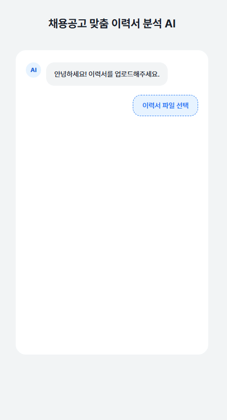
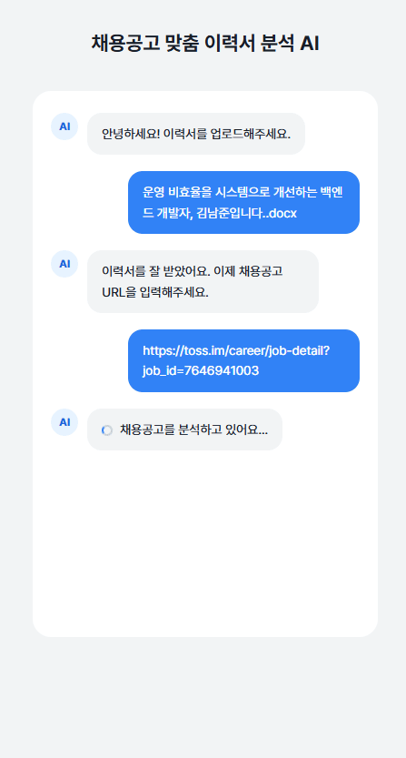
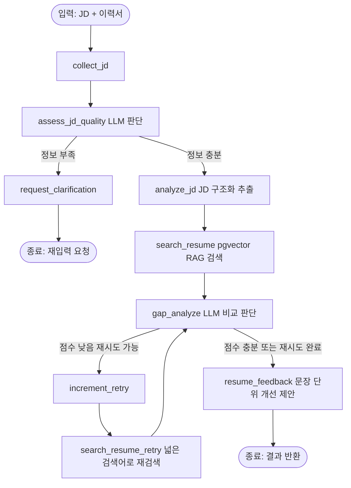

# JD Fit Agent

채용공고(JD)를 입력하면, AI 에이전트가 JD를 분석하고 내 이력서와 비교해 적합도 점수·강점·갭을 진단하고, 문장 단위로 이력서 개선 피드백까지 제공하는 서비스입니다.

단순 LLM 호출이나 RAG 검색 한 번으로 끝나는 구조가 아니라, **LangGraph 기반으로 판단·분기·재시도가 일어나는 에이전트**로 설계했습니다.

## 데모

### 1. 이력서 업로드 → 채용공고 URL 입력



### 2. 분석 결과가 채팅 형태로 순차 출력



## 문제 정의

채용공고를 볼 때마다 "내 경력이 여기 맞을까?", "어떤 경험을 어떻게 어필해야 할까?"를 매번 스스로 판단해야 합니다. 이 과정을 자동화하기 위해, JD와 이력서를 비교 분석하고 실질적인 개선 방향까지 제시하는 에이전트를 만들었습니다.

## 아키텍처



이 그래프 설계가 보여주는 3가지:

| 요소 | 어디서 드러나는가 |
|---|---|
| **Reasoning** | JD 품질 판단(`assess_jd_quality`)이 그래프의 분기를 직접 결정. `gap_analyze`가 JD 요구사항과 실제 경험을 비교해 점수·강점·갭을 추론 |
| **Tool use** | `search_resume`이 JD 분석 결과에 따라 동적으로 쿼리를 만들어 pgvector 검색을 호출. 점수가 낮으면 더 넓은 쿼리로 재검색 도구를 다시 선택 |
| **State management** | `visited_nodes`로 실행 경로 추적, `retry_count`로 무한 루프 방지. 재시도 루프(`gap_analyze` → `increment_retry` → `search_resume_retry` → `gap_analyze`)는 이전 상태를 기억해야만 가능한 구조 |

## 기술 스택

- **Backend**: Python, FastAPI
- **Agent**: LangGraph, OpenAI API (gpt-4o-mini)
- **Vector Search**: PostgreSQL + pgvector
- **Frontend**: React (Vite)
- **문서 처리**: python-docx (이력서 파싱), BeautifulSoup (JD 크롤링)

## 주요 기능

- JD URL 크롤링 또는 텍스트 직접 입력
- 이력서 파일(DOCX/TXT) 업로드 → 자동 chunk 분할 + 임베딩 저장
- pgvector 코사인 유사도 기반 이력서 RAG 검색
- JD 적합도 점수(`fit_score`), 강점(`strengths`), 갭(`gaps`) 산출
- 점수가 낮을 경우 검색 쿼리를 넓혀 자동 재시도 (최대 1회)
- 원문 사실 기반의 이력서 문장 개선 제안 (새로운 기술/경력 임의 생성 방지)

## 트러블슈팅 노트

개발 중 마주친 문제와 해결 과정을 기록합니다.

- **pgvector 컬럼 매핑 오류**: SQLAlchemy에는 `VECTOR` 타입이 없어 `pgvector.sqlalchemy.Vector`로 교체. FK 테이블명 단수/복수 오타로 인한 마이그레이션 실패 수정.
- **임베딩 차원 불일치 에러**: `embed_texts(["text"])[0]`을 `embed_texts(["text"][0])`로 잘못 작성해 문자열이 글자 단위로 분해되어 전달되던 버그 수정.
- **LangGraph state 키 오타**: 노드가 반환하는 dict의 키(`mached_chunks`)가 `AgentState` 정의(`matched_chunks`)와 달라 검색 결과가 항상 빈 배열로 전달되던 문제. TypedDict는 런타임에 키를 강제하지 않아 발견이 어려웠음.
- **PDF 텍스트 추출 실패**: Word 기반으로 디자인된 PDF는 `pypdf`/`pdfplumber` 모두 텍스트 추출 실패. 원본 DOCX 파일 업로드로 우회.

## 실행 방법

### 1. 환경변수 설정

`.env.example`을 복사해 `.env`로 만들고 값을 채웁니다.

```bash
cp .env.example .env
```

### 2. PostgreSQL (pgvector) 실행

```bash
docker run --name jd-fit-agent-postgres \
  -e POSTGRES_USER=app_user \
  -e POSTGRES_PASSWORD=app_password \
  -e POSTGRES_DB=jd-fit-agent \
  -p 5432:5432 \
  -d pgvector/pgvector:pg17
```

### 3. 백엔드 실행

```bash
pip install -r requirements.txt
uvicorn app.main:app --reload
```

### 4. 프론트엔드 실행

```bash
cd frontend
npm install
npm run dev
```

## API 명세

| Method | Endpoint | 설명 |
|---|---|---|
| POST | `/api/v1/resume` | 이력서 텍스트 직접 등록 |
| POST | `/api/v1/resume/upload` | 이력서 파일(DOCX/TXT) 업로드 |
| GET | `/api/v1/resume/{resume_id}` | 이력서 조회 |
| POST | `/api/v1/analysis/run` | JD 분석 + 적합도 진단 실행 |

## 향후 개선 사항

- 자기소개서 초안 / 면접 예상 질문 생성 노드 추가
- PDF 스캔/디자인 문서 대응을 위한 OCR 추가
- LangSmith 연동을 통한 실행 추적(trace) 가시화
- Docker Compose로 백엔드/DB/프론트 통합 배포 구성
- Golden Set 기반 평가 체계 구축